# XenonWZH 👋

- **Mathematics Undergraduate**
- **Former Competitive Programmer** (OIer, AFO)

---

### 🔭 Interests & Focus
- **Mathematics**: Systematic training in core undergraduate mathematics (analysis, algebra, geometry).
- **Deep Learning**: Currently studying deep learning, with an initial focus on computer vision.
- **Algorithms**: Strong foundation in algorithms and data structures (competitive programming).

### 🛠️ Tech Stack

  
  
  
  
  

- **Languages & Tools**: C++, Python, LaTeX.
- **Current Activity**: Broadening knowledge in mathematics and machine learning.

---

### 🌐 Presence
[**Blog**](https://xenonwzh.github.io/) · [**Zhihu**](https://www.zhihu.com/people/xen0nwzh) · [**Bilibili**](https://space.bilibili.com/322190458)

### 📊 GitHub Statistics

  

---

### 📫 Contact
- **Email**: xenonwzh [at] qq [dot] com
- **Pronouns**: he / him
